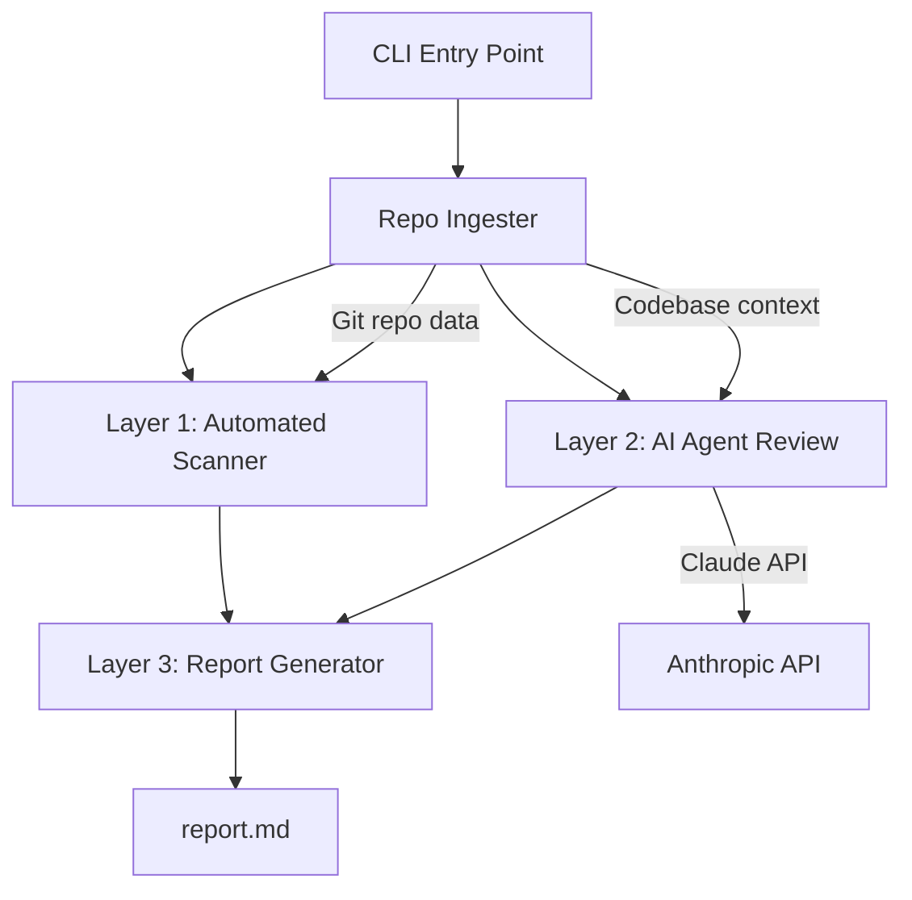

# TDD: Vetter

## 1. Technical Overview

### System Purpose

Vetter is a Python CLI tool that analyzes a candidate's Git repository submission and generates a structured `report.md` evaluating software engineering foundations and AI orchestration skills. It operates in three layers: automated static analysis, AI-powered expert review, and report generation.

### Key Technical Decisions

| Decision | Choice | Justification |
|----------|--------|---------------|
| Language | Python 3.12+ | Rich ecosystem for code analysis, fast development, team familiarity |
| CLI Framework | Click | Mature, well-documented, supports options/arguments/help out of the box |
| AI Model | Claude Sonnet 4.6 (default) | Best balance of quality/speed/cost for code review; Opus available via `--model` |
| AI SDK | Anthropic Python SDK | Official SDK, direct API access, well-maintained |
| Git Analysis | GitPython | Pythonic interface to Git repos, commit history, diffs |
| Package Manager | uv | Fast, modern Python package management |
| Report Format | Markdown (Jinja2 templates) | Human-readable, version-controllable, easy to share |

### Tech Stack

| Component | Package | Version | Purpose |
|-----------|---------|---------|---------|
| CLI | `click` | >=8.0 | Command-line interface |
| AI | `anthropic` | >=0.40 | Claude API client |
| Git | `gitpython` | >=3.1 | Repository analysis |
| Templates | `jinja2` | >=3.1 | Report markdown generation |
| Config | `pyyaml` | >=6.0 | Optional config file support |
| Progress | `rich` | >=13.0 | Terminal progress indicators and formatting |

---

## 2. Architecture

### 2.1 High-Level Architecture



**Data Flow:**
1. CLI receives repo path + options
2. Repo Ingester clones (if remote) and extracts repo data (files, commits, structure)
3. Layer 1 (Scanner) analyzes repo data for objective metrics
4. Layer 2 (AI Agent) sends codebase context to Claude for expert review
5. Layer 3 (Report Generator) combines both outputs into `report.md`

### 2.2 Component Design

#### Component: CLI (`cli.py`)
- **Responsibility**: Parse arguments, orchestrate the analysis pipeline, handle errors
- **Input**: `repo-path`, `--candidate`, `--repo-url`, `--output`, `--model`
- **Output**: Calls pipeline, writes report to disk
- **Dependencies**: Click, all layer modules

#### Component: Repo Ingester (`ingester.py`)
- **Responsibility**: Load Git repo, extract file tree, read source files, extract commit history
- **Input**: Local path or remote Git URL
- **Output**: `RepoData` dataclass containing files, commits, metadata
- **Dependencies**: GitPython
- **Considerations**: Skip binary files, respect `.gitignore`, limit file size (max 100KB per file)

#### Component: Layer 1 — Scanner (`scanner.py`)
- **Responsibility**: Run automated static analysis on repo data
- **Input**: `RepoData`
- **Output**: `ScanResult` dataclass with all metrics
- **Dependencies**: None (pure Python analysis, regex-based)
- **Considerations**: Language detection via file extensions and config files

#### Component: Layer 2 — AI Reviewer (`reviewer.py`)
- **Responsibility**: Send codebase to Claude, parse scored assessment
- **Input**: `RepoData`, model selection
- **Output**: `ReviewResult` dataclass with pillar scores and justifications
- **Dependencies**: Anthropic SDK
- **Considerations**: Token limit management — summarize large repos, send most relevant files

#### Component: Layer 3 — Report Generator (`report.py`)
- **Responsibility**: Combine scan + review results into formatted markdown
- **Input**: `ScanResult`, `ReviewResult`, candidate metadata
- **Output**: Rendered markdown string
- **Dependencies**: Jinja2

---

## 3. Data Design

### 3.1 Data Model

No database. All data is in-memory dataclasses, processed per run.

```python
@dataclass
class RepoData:
    path: str
    files: list[FileInfo]        # path, content, language, size
    commits: list[CommitInfo]    # hash, message, author, date, files_changed
    languages: dict[str, int]   # language -> file count
    total_files: int
    total_lines: int

@dataclass
class FileInfo:
    path: str
    content: str
    language: str
    size: int
    is_test: bool

@dataclass
class CommitInfo:
    hash: str
    message: str
    author: str
    date: datetime
    files_changed: int
    insertions: int
    deletions: int

@dataclass
class ScanResult:
    test_ratio: float               # test files / total source files
    has_linter_config: bool
    linter_configs_found: list[str]
    commit_count: int
    commit_quality: str             # "good" / "fair" / "poor"
    commit_messages: list[str]
    dependencies: list[str]
    error_handling: str             # "strategic" / "blanket" / "minimal"
    security_flags: list[str]       # list of findings
    languages: dict[str, int]

@dataclass
class PillarScore:
    name: str
    score: int                      # 1-5
    justification: str
    evidence: list[str]             # code snippets with file:line references

@dataclass
class ReviewResult:
    architecture_awareness: PillarScore
    code_refinement: PillarScore
    edge_case_coverage: PillarScore
    overall_summary: str

@dataclass
class Classification:
    label: str                      # "Copy-Paster" / "Assisted Engineer" / "AI Orchestrator"
    recommendation: str             # "Pass" / "Review Further" / "Reject"
    average_score: float
```

### 3.2 Storage Strategy

- **No persistent storage** — all data is ephemeral per CLI run
- Report is written to disk as markdown file
- No database, no cache (MVP)

---

## 4. API Design

No HTTP API. Vetter is a CLI tool. The "API" is the command interface:

```
vetter analyze <repo-path> [OPTIONS]

Options:
  --candidate TEXT    Candidate name for report header
  --repo-url TEXT     Repository URL for report header
  --output TEXT       Output file path (default: ./report.md)
  --model TEXT        Claude model to use (default: sonnet)
  --help              Show help message
```

**Exit Codes:**
- `0`: Success
- `1`: Error (invalid repo, API failure, etc.)

---

## 5. Integration Design

### 5.1 External Services

#### Anthropic Claude API

- **Purpose**: Layer 2 AI expert code review
- **Integration**: Anthropic Python SDK (`anthropic.Anthropic()`)
- **Authentication**: `ANTHROPIC_API_KEY` environment variable
- **Error Handling**:
  - `AuthenticationError`: Exit with message to check API key
  - `RateLimitError`: Retry once after 5 seconds, then fail
  - `APIError`: Exit with descriptive error message
- **Token Management**:
  - Max input: ~150K tokens (Sonnet context window)
  - Strategy: Send file tree + most relevant source files + commit summary
  - If repo exceeds token limit: prioritize source files over test files, skip vendor/generated code
- **Prompt Design**: Structured system prompt with rubric, user message with codebase context. The AI returns a JSON-structured response with scores and justifications.

---

## 6. Security Considerations

- **API Key**: Stored in `ANTHROPIC_API_KEY` env var only. Never logged, never included in reports.
- **Candidate Code**: Read into memory, sent to Claude API for analysis, not persisted beyond the session.
- **No Secrets in Output**: Report does not include API keys, tokens, or sensitive config values found in the repo (security flags reference them without exposing content).
- **Input Validation**: Validate repo path exists and is a valid Git repository before processing.

---

## 7. Testing Strategy

### Approach

Given the 6-hour timeline, testing focuses on critical paths:

| Layer | Test Type | What to Test |
|-------|-----------|-------------|
| CLI | Integration | Valid/invalid args, help output, exit codes |
| Ingester | Unit | File extraction, commit parsing, binary file skipping |
| Scanner | Unit | Test detection, linter config detection, commit quality scoring |
| Reviewer | Integration | Prompt construction, response parsing (mock API) |
| Report | Unit | Template rendering with sample data |

### Coverage Target
- MVP: Critical path coverage (happy path + main error cases)
- No coverage percentage target for 6-hour timeline

### Mocking Strategy
- Mock `anthropic.Anthropic` for Layer 2 tests
- Use a small fixture Git repo for ingester/scanner tests

---

## 8. Implementation Plan

### Bootstrap Phases (Initial Build)

#### Phase 1: Infrastructure
- Project setup: `uv init`, `pyproject.toml`, dependencies
- Directory structure and module scaffolding
- CLI entry point wired with Click
- Dataclasses/models defined (empty shells)
- Configuration (env vars, constants)

#### Phase 2: Business Domain
- Repo Ingester: Git repo → RepoData (files, commits, metadata)
- Scanner (Layer 1): static analysis metrics (test ratio, linter, commits, security)
- Reviewer (Layer 2): Claude API integration + Three Pillars scoring
- Report Generator (Layer 3): Jinja2 template → report.md
- Classification logic: scoring → label → recommendation
- Pipeline orchestration: CLI → Ingester → Scanner + Reviewer → Report

#### Phase 3: Testing & Calibration
- Unit tests per module (scanner, ingester, report)
- Integration test (mock API, end-to-end flow)
- Calibration: run on real repos, compare with manual judgment, adjust AI prompt

#### Phase 4: Documentation & Distribution
- README.md with installation and usage instructions
- Example report output
- `--help` text polished
- Publishable package (`uv build`, PyPI-ready)

### Development Cycle (New Features & Changes)

For ongoing development after the initial build:

1. **Spec**: Define the change — update PRD (if new requirement) or TDD (if architectural change). Create an ADR for significant decisions.
2. **Implement**: Write the code following existing patterns and conventions.
3. **Test**: Add or update tests to cover the change.
4. **Review**: Verify against acceptance criteria. Run on a real repo to validate.

### Technical Risks

| Risk | Impact | Mitigation |
|------|--------|-----------|
| Claude API token limits on large repos | Layer 2 fails or truncates | Smart file selection, skip vendor/generated code |
| AI scoring inconsistency between runs | Unreliable reports | Use temperature=0, structured output format |
| 6-hour timeline too tight | Incomplete MVP | Prioritize core flow, cut config file support (US-07) |
| Multi-language analysis complexity | Layer 1 shallow for some languages | Generic patterns work across languages; language-specific depth is post-MVP |

---

## 9. ADRs (Architectural Decision Records)

### ADR-001: Python + Click for CLI

- **Context**: Need a CLI tool built in 6 hours
- **Decision**: Python 3.12+ with Click
- **Consequences**: Fast development, rich ecosystem for code analysis, familiar to target users
- **Alternatives**: Node.js (Commander), Go (Cobra) — both viable but slower development for this use case

### ADR-002: No Database

- **Context**: MVP is a single-run CLI tool
- **Decision**: All data in-memory using dataclasses, no persistent storage
- **Consequences**: Simple architecture, no setup required, stateless. Limits future features (comparison, history) but those are post-MVP.
- **Alternatives**: SQLite — adds complexity without MVP benefit

### ADR-003: Jinja2 for Report Templates

- **Context**: Report must be structured, consistent markdown
- **Decision**: Use Jinja2 templates for report generation
- **Consequences**: Separation of report format from logic, easy to modify report structure, familiar templating
- **Alternatives**: f-strings / string concatenation — harder to maintain; full template engine (Mako) — overkill

### ADR-004: Structured JSON Response from Claude

- **Context**: Need to parse AI review into typed data (scores, justifications)
- **Decision**: Request structured JSON output from Claude, parse into dataclasses
- **Consequences**: Reliable parsing, typed data, easy to integrate with report generator
- **Alternatives**: Free-text response with regex parsing — fragile and error-prone

### ADR-005: Sonnet 4.6 as Default Model

- **Context**: Need balance of quality, speed, and cost for code review
- **Decision**: Default to Claude Sonnet 4.6, allow Opus via `--model` flag
- **Consequences**: Fast analysis (< 5 min), lower cost per run, sufficient quality for code review. Opus available when deeper analysis needed.
- **Alternatives**: Opus only — slower and more expensive for routine use

---

## Project Structure

```
vetter-cli/
├── docs/
│   ├── prompts/
│   ├── ADRs/
│   ├── IDEA.md
│   ├── PRD.md
│   └── TDD.md
├── src/
│   └── vetter/
│       ├── __init__.py
│       ├── cli.py              # Click CLI entry point
│       ├── ingester.py         # Git repo data extraction
│       ├── scanner.py          # Layer 1: automated static analysis
│       ├── reviewer.py         # Layer 2: AI agent review
│       ├── report.py           # Layer 3: report generation
│       ├── models.py           # Dataclasses (RepoData, ScanResult, etc.)
│       └── templates/
│           └── report.md.j2    # Jinja2 report template
├── tests/
│   ├── __init__.py
│   ├── test_ingester.py
│   ├── test_scanner.py
│   ├── test_reviewer.py
│   └── test_report.py
├── pyproject.toml
└── README.md
```
